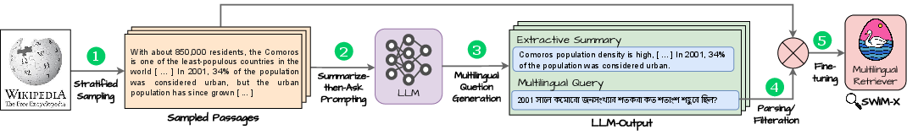

# SWIM-IR
<p align="center">

</p>

## Overview

SWIM-IR is a Synthetic Wikipedia-based Multilingual Information Retrieval training dataset consisting of 28 million query-passage pairs spanning 33 languages. Multilingual passages are sampled from Wikipedia and are paired with queries generated by PaLM-2 using a novel summarize-then-ask prompting (SAP) generation method.

Models trained on SWIM-IR achieve good performance on XOR-Retrieve (cross-lingual), and MIRACL (multilingual).\* SWIM-IR based models achieved a new state-of-the-art on XTREME-UP, a cross-lingual retrieval benchmark for under-represented and scarce-data languages.

\* The released SWIM-IR v1.0 training data currently covers 10 of the 18 MIRACL languages, but is complete for XOR-Retrieve and XTREME-UP.

## Dataset Generation


**Figure 1:** SWIM-IR dataset generation process. Sampled Wikipedia passages are provided to an LLM (PaLM-2) using the novel summarize-then-ask prompting (SAP) method.

The SWIM-IR dataset is generated by first sampling passages from Wikipedia. The passages are then provided to PaLM-2 along with a prompt that asks the model to summarize the passage. The model is then prompted to ask a question that can be answered by the passage. The end-to-end process is illustrated in Figure 1. Summarize-then-ask prompting (SAP) aids the model in generating good information seeking queries for each specific input passage.


## Download

The SWIM-IR dataset can be downloaded using the links below:

* [SWIM-IR v1.0](
http://storage.googleapis.com/gresearch/swim-ir/swim_ir_v1.tar.gz
) (Nov 9, 2023)

### Data Format

SWIM-IR is partitioned into three sections (/directories): `cross_lingual`,  `cross_lingual_ext`, and `monolingual`. The `cross_lingual` section contains training data that can be used for evaluation on XOR Retrieve, while the `cross_lingual_ext` section can be used for evaluations on XTERME-UP. The `monolingual` section can be used for MIRACL evaluation.

Each section contains language specific JSONL files with the fields:  `_id`, `lang`, `code`, `query`, `title` and `text`. Synthetic questions generated by PaLM-2 about the passage are stored in the  `query` field. The `text` field contains a sampled passage from Wikipedia, while `title` is the title of the passage's article. 

For the `monolingual` data, `lang` is the language of both the query and passage with the corresponding langauge code being stored in `code` (e.g., 'fr'). For the `cross_lingual` and `cross_lingual_ext` data, the queries are in English, while `lang` and `code` indicate the language and language code of the passage.


Below is a JSON example from SWIM-IR for a question in Chinese, "托马斯·爱迪生在哪里发明了留声机？" [Where did Thomas Edison invent the phonograph?]. 

```javascript
{'_id': '10770836',
'lang': 'Chinese',
'code': 'zh',
'query': '托马斯·爱迪生在哪里发明了留声机？', 
'title': 'Menlo Park, New Jersey',
'text': 'Menlo Park is an unincorporated community located \
within Edison Township in Middlesex County, New Jersey, United \
States. In 1876, Thomas Edison set up his home and research \
laboratory in Menlo Park, which at the time was the site of an \ unsuccessful real estate development named after the town of \
Menlo Park, California. While there, he earned the nickname \
"the Wizard of Menlo Park". The Menlo Park lab was significant \
in that it was one of the first laboratories to pursue practical \
commercial applications of research. It was in his Menlo Park \
laboratory that Thomas Edison invented the phonograph and developed'
}
```
Note that within the SWIM-IR dataset, JSON examples are stored as JSONL with one JSON example per line. Multiple line JSON is used above to make the example more readable.

### Prompts

Prompts given to PaLM-2 to generate the three parts of our dataset are provided below:

* [Cross-Lingual Prompts (XOR Retrieve)](XOR-Retrieve-prompts.csv)
* [Multi-Monolingual Prompts (MIRACL)](MIRACL-prompts.csv)
* [Cross-Lingual Extended Prompts (XTREME-UP)](xtreme-up-prompts.csv)

## Paper

SWIM-IR is described in datail in the paper [Leveraging LLMs for Synthesizing Training Data Across Many Languages in Multilingual Dense Retrieval](https://arxiv.org/abs/2311.05800) by Nandan Thakur, Jianmo Ni, Gustavo Hernández Ábrego, John Wieting, Jimmy Lin and Daniel Cer. Please cite our paper in research work that uses or discusses SWIM-IR.

### BibTeX

```shell
@article{swim-ir-dataset,
  author    = {Nandan Thakur and
               Jianmo Ni and
               Gustavo Hern\'andez \'Abrego$^\lozenge$ and
               John Wieting and
               Jimmy Lin and
               Daniel Cer},
  title     = {Leveraging LLMs for Synthesizing Training Data Across Many Languages in Multilingual Dense Retrieval},
  journal   = {CoRR},
  volume    = {abs/2311.05800},
  year      = {2023},
  url       = {https://arxiv.org/abs/2311.05800},
  eprinttype = {arXiv},
  primaryClass={cs.IR},
  eprint    = {2311.05800},
}
 
```

## Contact

Questions about the SWIM-IR dataset can asked by creating an issue on this repository or by sending them to <a href="mailto:swim-ir-dataset@googlegroups.com<">
swim-ir-dataset@googlegroups.com</a>

## License

<p xmlns:cc="http://creativecommons.org/ns#" xmlns:dct="http://purl.org/dc/terms/"><span property="dct:title">The SWIM-IR dataset</span> is licensed under <a href="http://creativecommons.org/licenses/by-sa/4.0/?ref=chooser-v1" target="_blank" rel="license noopener noreferrer" style="display:inline-block;">CC BY-SA 4.0 </a></p>
